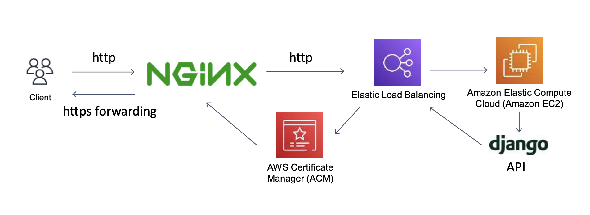

## 개요

`Haberman's Survival Dataset`을 활용하여 데이터를 CoxPH 모델에 피팅하고 시각화 해주는 툴입니다.

통계적 지식에 대한 소개와 더불어 직접 실습 데이터를 추가하여 그래프를 그려볼 수 있도록 하였습니다.

## 아키텍쳐

### 1. Frontend

#### 1-1. UI

리액트 기반의 정적 사이트 생성기 `Docusaurus`(이하 도큐사우르스)를 사용하여 블로그 템플릿을 기반으로 UI를 제작하였습니다.

도큐사우르스에서는 `.md` 문서에 커스텀 컴포넌트를 적용할 수 있는 `MDX` 문법을 제공합니다. `src/components` 폴더 아래에 커스텀 컴포넌트를 제작하고 마크다운 문서 내에 컴포넌트를 삽입하면 됩니다.

마크다운 문서 최상단 설정 관련 내용 하단에 컴포넌트 import 후 사용합니다.

```md
---
config1: ...
config2: ...
---

import Component from "...."

<Component />
```

이미지 중앙맞춤을 위해 몇가지 스타일링을 전역적으로 적용해야 했는데 이때 `styled-components`의 `createGlobalStyle`을 통해 전역 스타일링 컴포넌트를 정의하였습니다. 밑에서 언급할 스위즐링 컴포넌트 `Layout`에 위치시켜 스타일링을 적용하였습니다.

차트 시각화는 `react-chartjs-2`를 사용하였습니다. 백엔드로부터 CoxPH 예측확률 데이터를 306명의 환자로부터 무작위로 뽑아오는 API로부터 받아올 수 있게 설계하였습니다. x축에 30-80세까지의 나이, y축에 확률을 나타내는 0부터 1까지의 값으로 구성하여 생존확률 그래프를 작성하였습니다.

나머지 버튼 및 텍스트필드 등 기본적인 컴포넌트는 `mui`를 사용하였습니다.

#### 1-2. 상태관리

MDX문법 내에서 컴포넌트에 이벤트 함수를 붙여넣고 프롭스를 주고받는게 어렵기 때문에 전역상태관리 라이브러리 `redux`를 사용하였습니다.

리덕스를 리액트에 적용하기 위해서는 최상위 컴포넌트를 `Provider` 컴포넌트로 래핑시켜야 하는데, 도큐사우르스에서의 엔트리포인트는 개발자들이 작성해둔 내부 코드에 숨겨져 있기 때문에 도큐사우르스에서 제공하는 **스위즐링 방법을** 사용해야 합니다.

스위즐링은 내부에 구현되어 있는 컴포넌트를 작성자가 원하는대로 수정한다거나 다른 컴포넌트로 래핑시키고자 할 때 사용합니다. 컴포넌트별 커스텀 시 위험여부는 명시가 되어 있기 때문에 이에 따라 진행하면 됩니다. 자세한 내용은 [다음 링크를 참조해주세요.](https://docusaurus.io/docs/swizzling)

도큐사우르스의 내부 컴포넌트에는 `Layout`이라는 컴포넌트가 존재합니다. 해당 컴포넌트를 래핑시켜주면 전역적으로 컴포넌트를 래핑시킬 수 있습니다. [(소스코드)](https://github.com/Parkjju/haberman-dataset-visualization/blob/c6a20c5f4a853bdd581b03e974e53c6fbd4a3ab0/src/theme/Root.js#L19-L28)

#### 1-3. API 연동

CoxPH 모델 예측확률을 계산하여 백엔드로부터 넘겨받도록 API 몇개를 정의하였습니다. 이때 라이브러리는 `axios`, `react-query`를 사용하였습니다.

리액트 쿼리를 사용하기 위해 엔트리포인트를 `QueryClient` 컴포넌트로 래핑시켜야 하는데 이 또한 스위즐링된 `Layout` 컴포넌트를 래핑하는 식으로 구현하였습니다.

### 2. Backend

[(백엔드 레포지토리 링크)](https://github.com/Parkjju/habermans-survival-visualization-backend)

#### 2-1. 모델 정의

백엔드는 Django-Rest-Framework(이하 DRF) 기반의 프로젝트로 서버를 구축하였습니다. `Patient`라는 모델을 정의하여 환자별 CoxPH 모델 피팅에 필요한 데이터들을 모델 속성으로 관리합니다.

```python
from django.db import models

class Patient(models.Model):
    age = models.IntegerField()
    operation_year = models.IntegerField()
    nb_pos_detected = models.IntegerField()
    surv = models.IntegerField()

    def __str__(self):
        return f"Patient {self.pk}"
```

#### 2-2. 데이터베이스 로드

서버가 본격적으로 구축되기 이전 모델 마이그레이션 후 환자들에 대한 306개의 초기 데이터를 Patient 모델에 기반하여 로드해두어야 했습니다.

로컬 위치에 `haberman.csv`라는 이름으로 데이터셋 파일을 저장해둔 뒤 이를 서버상에 로드하는 파이썬 쉘 코드를 `load.py`라는 이름으로 작성하였습니다.

```python
import csv
from visualization.models import Patient

with open('./visualization/fixtures/haberman.csv') as csv_file:
    csv_reader = csv.reader(csv_file, delimiter=',')
    line_count = 0
    for row in csv_reader:
        patient = Patient(age=row[0], operation_year=row[1], nb_pos_detected=row[2], surv=row[3])
        patient.save()
        line_count += 1

print(f'Processed {line_count-1} lines.')

# 저장된 데이터 확인
patients = Patient.objects.all()
for patient in patients:
    print(patient)
```

데이터베이스 로드를 위해서는 AWS EC2 인스턴스에서 장고 프로젝트에 이동 후 쉘에 `python manage.py shell < load.py` 커맨드를 입력하면 됩니다.

#### 2-3. API 정의

API는 두 개의 GET요청을 처리하도록 정의하였습니다.

1. `predict_survival`: 306개의 기존 데이터셋으로부터 3개 데이터셋을 추출하여 CoxPH 피팅 후 생존확률을 클라이언트에 JSON 형식으로 넘겨줍니다. [(소스코드)](https://github.com/Parkjju/habermans-survival-visualization-backend/blob/c29c99e213cd4fee5911eeaa2d0a8133dcf7c6f6/haberman/visualization/views.py#L35-L65)
2. `predict_new`: 사용자로부터 환자 나이, 수술 연도, 생존여부, 양성림프종 발견 개수 데이터를 쿼리 파라미터로 전달받아 새로운 CoxPH 피팅 생존확률을 계산한 뒤 클라이언트에 JSON 형식으로 넘겨줍니다. [(소스코드)](https://github.com/Parkjju/habermans-survival-visualization-backend/blob/c29c99e213cd4fee5911eeaa2d0a8133dcf7c6f6/haberman/visualization/views.py#L67-L96)

#### 2-4. 배포

배포는 AWS EC2를 기반으로 하였습니다. 프론트엔드는 `github-pages`서비스를 사용하여 배포하였는데, github-pages는 HTTPS 서빙을 강제하기 때문에 EC2와 Nginx를 사용하여 HTTP 기반의 배포를 하게 되면 `mixed-content` 에러가 발생하여 데이터를 서버로부터 로드하지 못하는 문제가 발생합니다.

따라서 로드밸런서, AWS Certificate Manager를 통해 HTTPS 처리를 한 뒤 nginx에서 클라이언트에게 데이터를 전송할때는 HTTPS 프로토콜로 포워딩 하도록 아키텍처를 구성하였습니다.


