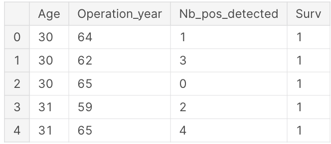
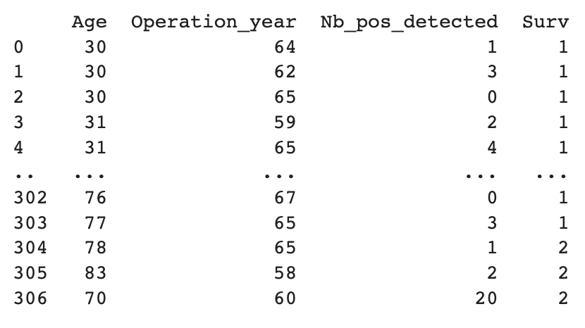
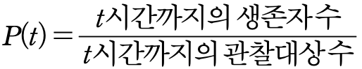

import MyChart from '@site/src/components/MyChart'
import ButtonGroup from "@site/src/components/ButtonGroup"

# 개요

Cox PH Model은 생존분석에서 가장 널리 사용되는 방법 중 하나이며, 이 모델을 기반으로 한 웹앱을 제작하여 생존 분석에 대한 이해도와 활용도를 높일 수 있다.

본 연구의 목적은 Cox PH Model을 이용하여 생존 분석을 수행하는 웹앱을 제작하여 사용자 친화적이며 직관적인 인터페이스를 갖춘 웹앱을 개발하고자 하는 것이다. `lifelines` 라이브러리 적용을 통해 생존분석 데이터의 시각화가 최종 목표이다. 우리는 이를 위한 분석의 한 예로 `haberman's survival dataset`을 이용한다.

<MyChart />

<ButtonGroup />

## 데이터 구성



위 데이터셋의 이름은 `Haberman's survival dataset`이다. 1958~1970년까지 시카고대학 빌링스 병원에서 유방암 수술을 받은 환자의 생존율에 대해 수행한 연구 사례가 포함되어 있다.

각 컬럼은 다음 정보를 나타낸다.

1. `Age`: 환자의 나이
2. `Operation_year`: 수술당시 연도를 10의 자리까지만 나타낸 값
3. `Nb_pos_detected`: 양성 림프종 수
4. `Surv`: 환자가 수술 후 5년 이내에 사망하였는지 여부. 5년 내에 사망할 경우 2라는 값을 갖는다.

이 데이터셋에서는 주로 생존 기간이 아닌 수술 후 5년 이내 생존 여부가 중요한 관심사이다. 따라서, 수술 후 5년 이내 생존한 환자들의 비율을 전체 환자 수로 나누어 생존율을 계산할 수 있다. 이러한 생존율은 해당 데이터셋에서 Surv값이 1인 환자들의 비율로 정의된다.

## 데이터 취득방식

### 3.1 Kaggle 소개

Kaggle에서는 전 세계적으로 데이터 사이언티스트들이 데이터셋을 공유하고 분서 결과를 공유할 수 있도록 지원하고 있다. 이러한 공유는 머신 러닝, 데이터 분석, 인공 지능 등의 분야에서 연구 및 개발에 많은 도움을 준다.

특히, Kaggle에서 제공하는 데이터셋은 다양한 분야에서 활용되어 논문이나 연구 보고서 등에 레퍼런스로 사용될 수 있다. `Haberman's survival dataset` 또한 Kaggle에서 다양한 용도로 활용되고 있으며, 이를 활용한 논문이나 연구 보고서가 발표되어 인용되는 경우도 있다.

아래는 Kaggle에서 제공하는 데이터셋을 활용하여 작성된 논문들의 예시이다.
아래는 그 예시이다.

1. [캐글 데이터셋을 이용한 머신러닝 악성코드 분류시스템에서 분류정확도 향상방법 - 한국컴퓨터정보학회 학술발표논문집 - 한국컴퓨터정보학회 : 논문 - DBpia](https://www.dbpia.co.kr/journal/articleDetail?nodeId=NODE08757681)
2. [Deep Learning for Practical Image Recognition | Proceedings of the 24th ACM SIGKDD International Conference on Knowledge Discovery & Data Mining](https://dl.acm.org/doi/abs/10.1145/3219819.3219907)
3. [1905.07203 Transfer Learning based Detection of Diabetic Retinopathy from Small Dataset](https://arxiv.org/abs/1905.07203)

파이썬 개발환경에서 아래 코드를 입력하여 데이터셋을 출력한 결과이다.

```python
import pandas as pd data = pd.read_csv('/content/haberman.csv', names = ['Age','Operation_year','Nb_pos_detected','Surv'])
```



## 분석 방법론

### 4.1 생존 분석

생존분석은 시간의 흐름에 따른 어떠한 사건의 발생 확률을 알아보는 통계 분석 및 예측 기법이다. 일반적으로 의료분야에서 특정 수술 방법 혹은 치료 방법에 따른 환자의 생존 기간을 분석할 때 활용하거나, 일반적인 IT 분야에서는 시간에 따른 사용자 이탈 분석에도 활용한다. 일반적으로 생존함수(survival function) S(t)는 다음과 같이 정의한다.


위와 같이 특정 시간 t보다 오래 생존할 확률을 뜻하는 생존함수가 있는 반면, 위험함수(hazard function)는 t시점 직후 사망할 확률을 의미한다. 흔히 생존분석에서는 위험함수가 시간에 따라 변하는 추세를 시간에 따른 위험의 변화로 나타내기 때문에 위험함수가 갖는 의미가 크다. 위험함수는 다음과 같이 정의한다.


## 4.2 Censored Data

생존분석 시 관찰이 종료되는 시점 사이에서 사건 발생 여부를 확인할 수 없는 자료를 중도절단(censored) 자료라고 한다. 일반적인 통계분석 방법과는 다르게 생존분석에서는 이런 자료를 포함하여 분석을 진행한다. 중도절단 종류는 다양한데 left censoring(좌중도절단)은 실제 값이 특정 값 이하인 것은 알고 있지만 그 값이 정확히 어떤 값인지 모를 때 발생한다. right censoring(우중도절단)은 실제 값이 특정 값 이상인 것은 알고 있으나 그 값이 정확히 어떤 값인지 모를 때 발생한다.

## 4.3 Kaplan-Meier

생존 분석에서 특정시기보다 더 오래 생존할 확률을 추정하는 것을 ‘생존함수’라고 하는데 일반적으로 Kaplan-Meier 방법을 통해 추정할 수 있다. Kaplan-Meier 방법은 사건 발생 시점마다 생존율을 구하고 최종적으로 누적생존율을 산출한다. 관찰기간 순서대로 자료를 정렬하고 각 구간별로 생존자수의 비율인 구간생존율 P(t)를 구한다. 누적생존율 S(t)는 구간별 구간생존율을 곱해서 산출할 수 있다.




x축은 시간 t를 나타내며 y축은 대상이 시간 t 이후에도 사건을 경험하지 못할 확률을 나타낸다. Kaplan-Meier curve를 통해 특정 시점의 생존율을 추정할 수 있다.

## 4.4 Cox PH Model

Cox비례위험모형(Cox proportional hazard model)은 생존기간과 영향을 미치는 여러 요인을 알아보는 분석이다. Kaplan-meier이 사건이 발생한 것에 초점을 둔다면, Cox분석은 생존에 영향을 미치는 여러 위험요소에 대해 분석한다. 따라서 Kaplan-Meier 분석이 집중하는 특성 외의 다른 요인은 통제할 수 없다는 한계가 있기 때문에 Cox 비례위험모형을 사용한다. 또한, 이 모형은 생존시간에 대해 어떠한 분포형태도 가정하지 않으므로 비모수적이면서 모형에 근거한 회귀계수를 추정한다는 점에서 semiparametric 모형이라고도 한다.

Cox PH 모형은 다양한 관측치들을 동시에 통제하여, 사건 발생에 미치는 영향을 분석하는 다변량 분석법이다. 또한 생존함수가 지수함수(Exponential Function)를 따른다는 것과 두 군의 위험비가 연구기간동안 일정하게 유지된다는 비례위험가정, 이 두 가지 가정이 요구된다. 특정 시점에서의 생존함수는 위험비에 대한 지수함수로 표현될 수 있어야 하며, 위험비는 연구기간 내 일정하게 유지되어야 한다. 이 모형의 식은 다음과 같다.


i번째 환자의 예후변수 값이 X_i이고, Beta_i는 회귀모형 계수이며 공변량의 영향을 측정한다. 만약 모든 예후변수가 0값을 가진다면 위험함수에 미치는 변수의 영향이 없다는 뜻이고 이런 경우엔 기본적으로 위험함수가 h_0(t)가 되므로 이는 기저위험함수(baseline hazard function)라고 한다.

Beta_i의 부호는 대상의 위험에 영향을 미친다. Beta_i가 양수일 때 사건의 위험도가 더 높기 때문에 특정 대상에 대한 사건 발생 확률이 더 높다는 것을 의미한다. 반면 음수일 때는 사건 발생 위험이 더 낮다는 것을 의미한다. 또한 값이 1과 같다면 위험에 영향을 미치지 않고 1보다 작은 값의 경우 위험도가 낮으며 1보다 클 경우 위험도가 높다는 것을 의미한다.

인간을 대상으로 하는 생존분석에는 수많은 변수가 존재하기 때문에 하고자 하는 연구에 맞는 예후 인자들을 조정하여 원하는 결과를 도출할 수 있다.

## 4.5 Reference

1. Cox 비례위험모형을 이용한 우측 대장암 3기 자료 분석 – 한국데이터정보과학회 : 논문 – DBpia
2. Survival analysis: Part I — analysis of time-to-event, Junyong In et al., Korean Journal of Anesthesiology, 2018
3. 박난희(2010). 생존분석 자료를 이용한 Cox비례위험함수모형의 고찰. 석사학위논문. 이화여자대학교. 서울.
4. [Axillary lymph node dissection (ALND) | Canadian Cancer Society](https://cancer.ca/en/treatments/tests-and-procedures/axillary-lymph-node-dissection-alnd)
5. [Anatomy, Shoulder and Upper Limb, Axillary Lymph Nodes - StatPearls - NCBI Bookshelf](https://www.ncbi.nlm.nih.gov/books/NBK559188/)
6. [UCI Machine Learning Repository: Haberman's Survival Data Set](https://archive.ics.uci.edu/ml/datasets/Haberman's+Survival)
