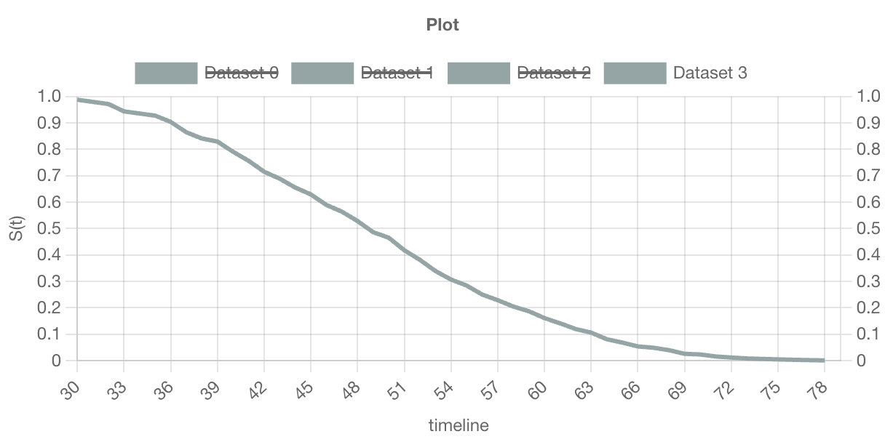
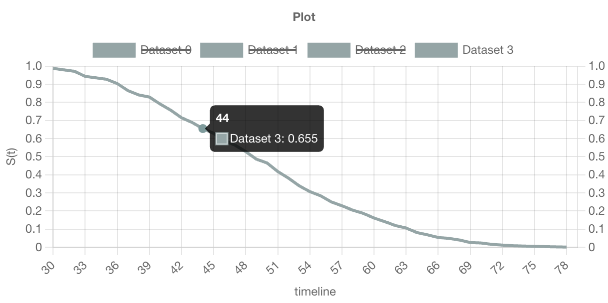

import MyChart from '@site/src/components/MyChart'
import ButtonGroup from "@site/src/components/ButtonGroup"
import Kaplan from "@site/src/components/Kaplan"
import Kaplan2 from "@site/src/components/Kaplan2"
import Table from "@site/src/components/Table"

## 0. 개요

Cox PH Model은 생존분석에서 가장 널리 사용되는 방법 중 하나이며, 이 모델을 기반으로 한 웹앱을 제작하여 생존 분석에 대한 이해도와 활용도를 높일 수 있다.

본 연구의 목적은 Cox PH Model을 이용하여 생존 분석을 수행하는 웹앱을 제작하여 사용자 친화적이며 직관적인 인터페이스를 갖춘 웹앱을 개발하고자 하는 것이다. 우리는 이를 위한 분석의 한 예로 `haberman's survival dataset`을 이용한다.

아래의 그래프는 `haberman's survival dataset`을 활용하여 CoxPH 모델 피팅 후 산출된 데이터를 시각화한 결과물이다.

<MyChart onlyFirst="true" strokeColor="#95a5a6" backgroundColor="#95a5a6" />

KaplanMeier, CoxPH 모델 피팅은 파이썬의 `lifelines` 라이브러리를 사용하였다.

## 1. 데이터 구성


위 데이터셋의 이름은 `Haberman's survival dataset`이다. 1958~1970년까지 시카고대학 빌링스 병원에서 유방암 수술을 받은 환자의 생존율에 대해 수행한 연구 사례가 포함되어 있다.

각 컬럼은 다음 정보를 나타낸다.

1. `Age`: 환자의 나이
2. `Operation_year`: 수술당시 연도를 10의 자리까지만 나타낸 값
3. `Nb_pos_detected`: 양성 림프종 수
4. `Surv`: 환자가 수술 후 5년 이내에 사망하였는지 여부. 5년 내에 사망할 경우 2라는 값을 갖는다.

이 데이터셋에서는 주로 생존 기간이 아닌 수술 후 5년 이내 생존 여부가 중요한 관심사이다. 따라서, 수술 후 5년 이내 생존한 환자들의 비율을 전체 환자 수로 나누어 생존율을 계산할 수 있다. 이러한 생존율은 해당 데이터셋에서 Surv값이 1인 환자들의 비율로 정의된다.

## 2. 데이터 취득방식

Kaggle에서는 전 세계적으로 데이터 사이언티스트들이 데이터셋을 공유하고 분서 결과를 공유할 수 있도록 지원하고 있다. 이러한 공유는 머신 러닝, 데이터 분석, 인공 지능 등의 분야에서 연구 및 개발에 많은 도움을 준다.

특히, Kaggle에서 제공하는 데이터셋은 다양한 분야에서 활용되어 논문이나 연구 보고서 등에 레퍼런스로 사용될 수 있다. `Haberman's survival dataset` 또한 Kaggle에서 다양한 용도로 활용되고 있으며, 이를 활용한 논문이나 연구 보고서가 발표되어 인용되는 경우도 있다.

아래는 Kaggle에서 제공하는 데이터셋을 활용하여 작성된 논문들의 예시이다.
아래는 그 예시이다.

1. [캐글 데이터셋을 이용한 머신러닝 악성코드 분류시스템에서 분류정확도 향상방법 - 한국컴퓨터정보학회 학술발표논문집 - 한국컴퓨터정보학회 : 논문 - DBpia](https://www.dbpia.co.kr/journal/articleDetail?nodeId=NODE08757681)
2. [Deep Learning for Practical Image Recognition | Proceedings of the 24th ACM SIGKDD International Conference on Knowledge Discovery & Data Mining](https://dl.acm.org/doi/abs/10.1145/3219819.3219907)
3. [1905.07203 Transfer Learning based Detection of Diabetic Retinopathy from Small Dataset](https://arxiv.org/abs/1905.07203)

파이썬 개발환경에서 아래 코드를 입력하여 데이터셋을 출력한 결과이다.

```python
import pandas as pd data = pd.read_csv('/content/haberman.csv', names = ['Age','Operation_year','Nb_pos_detected','Surv'])
```


## 3. 분석 방법론

### 3.1 생존 분석

생존분석은 시간의 흐름에 따른 어떠한 사건의 발생 확률을 알아보는 통계 분석 및 예측 기법이다. 사건 발생을 시간의 함수로 모델링하여 일정 시점에서의 생존 확률을 추정한다. 사건 발생까지의 시간이 집단 간에 차이가 있는지 확인하고, 어떤 변수들이 사건 발생까지 시간에 영향을 미치는지 분석한다. 일반적으로 의료분야에서 특정 수술 방법 혹은 치료 방법에 따른 환자의 생존 기간을 분석할 때 활용하거나, 일반적인 IT 분야에서는 시간에 따른 사용자 이탈 분석에도 활용한다.

### 3.2 Censored Data

생존분석 시 관찰이 종료되는 시점 사이에서 사건 발생 여부를 확인할 수 없는 자료를 중도절단(censored) 자료라고 한다. 일반적인 통계분석 방법과는 다르게 생존분석에서는 이런 자료를 포함하여 분석을 진행한다. 중도절단 데이터는 관측기간 동안 분석 대상자에게서 사건이 일어나지 않을 때 발생한다. 환자의 추적이 어려운 상태, 환자가 더 이상 실험에 참여하지 않기로 결정한 상태, 연구 종료로 더 이상의 추적조사 불가능한 상태, 연구와 관련 없는 이유로 사망한 상태 등의 경우에 해당된다. 중도절단 종류는 다양한데 left censoring(좌중도절단)은 실제 값이 특정 값 이하인 것은 알고 있지만 그 값이 정확히 어떤 값인지 모를 때 발생한다. right censoring(우중도절단)은 실제 값이 특정 값 이상인 것은 알고 있으나 그 값이 정확히 어떤 값인지 모를 때 발생한다.

### 3.3 생존함수와 위험함수

생존함수(survival function)는 적어도 $t$시점까지 생존할 확률을 의미한다. 일반적으로 생존 함수는 아래와 같이 나타낸다.

$$
S(t) = Pr(T > t) = 1 - F(t)
$$

$$
F(t) = Pr(T\leq t) = \int_{0}^{t}f(s)ds
$$

-   $S(t)$: 생존함수
-   $T$: 생존시간
-   $F(t)$: $T$의 누적확률분포함수
-   $f(s)$: $T$의 확률밀도함수

위와 같이 특정 시간 $t$보다 오래 생존할 확률을 뜻하는 생존함수가 있는 반면, 위험함수(hazard function)는 $t$시점 직후 사망할 확률을 의미한다. 흔히 생존분석에서는 위험함수가 시간에 따라 변하는 추세를 시간에 따른 위험의 변화로 나타내기 때문에 위험함수가 갖는 의미가 크다. 위험함수는 다음과 같이 정의한다.

$$
h(t) = \lim_{\Delta t \rightarrow 0}\frac{Pr(t\leq T < t +\Delta t | T > t)}{\Delta t}
$$

-   $h(t)$: 위험함수
-   $T$: 생존시간

즉, 생존시간이 $t$보다 크다는 조건 하에서 해당시점 또는 바로 직후에 사망할 확률을 의미한다. 이때, $\Delta t$는 매우 짧은 시간을 의미하며, 시간 간격 $\Delta t$가 커질수록 위험이 커지는 것을 막기 위해 이 확률을 $\Delta t$로 나누어 준다. 이처럼 위험함수는 정의에서 보다시피 순간적인 위험 이 짧은 시간에 일어나는 극한의 의미를 지닌다.

### 3.4 Kaplan-Meier

생존함수는 일반적으로 Kaplan-Meier 방법을 통해 추정할 수 있다. 생존 분석에서 KM 추정량을 사용하기 전에 세 가지 가정이 필요하다.

1. Censored data는 분석을 계속하는 대상과 동일한 생존 전망을 가지고 있다.
2. 생존 확률은 대상이 연구에 참여하는 시기와 관계없이 동일하다.
3. 관심 대상 사건은 지정된 시간에 발생한다. 이는 사건이 두 번의 검사 사이에서 발생할 수 있기 때문이다. 검사 간의 시간 간격이 매우 작을수록 추정된 생존 시간을 더 정확하게 측정할 수 있다.

검사 간의 시간 간격이 매우 작을수록 추정된 생존 시간을 더 정확하게 측 정할 수 있다.

Kaplan-Meier 방법은 사건 발생 시점마다 생존율을 구하고 최종적으로 누적생존율을 산출한다. 관찰기간 순서대로 자료를 정렬하고 각 구간별로 생존자수의 비율인 구간생존율 $P(t)$를 구한다. 누적생존율 $S(t)$는 구간별 구간생존율을 곱해서 산출할 수 있다.

$$
P(t) = \frac{t시간까지의 생존자수}{t시간까지의 관찰대상 수}
$$

$$
\hat{S}(t) = \prod_{i\leq t}(1-\frac{d_{t}}{n_{t}}) = \prod_{i\leq t}p_{t} = p_{1} \times p_{2} \times \cdot\cdot\cdot \times p_{t-1} \times p_{t} = \hat{S}(t-1) \times p_{t}
$$

-   $\hat{S}(t)$: $t$시점에서의 생존확률추정치
-   $p_{t}$: $t$시점에서의 생존비율
-   $d_{t}$: $t$시점에서의 사망자수
-   $n_{t}$: $t$시점에서의 생존자수

<!-- <MyChart strokeColor="#95a5a6" backgroundColor="#95a5a6" /> -->

<Kaplan strokeColor="#95a5a6" backgroundColor="#95a5a6" />

예를 들어 위 그래프를 보면 operation year이 50년일 때 전체 환자 그룹의 60% 정도가 여 전히 생존해 있음을 알 수 있다. 이렇게 Kaplan-Meier curve를 통해 특정 시점의 생존율을 추정할 수 있다.

<Kaplan2 strokeColor="#95a5a6" backgroundColor="#95a5a6" />

이 그래프는 두 집단의 생존확률을 비교하기 위한 것으로 양성림프종 수가 0개, 1개 이상인 집단으로 나눴다. operation year이 45년 이전일 때 두 집단의 생존 확률은 큰 차이가 없지만 그 이후에는 양성림프종수가 하나도 없는 집단의 생존확률이 1개 이상인 집단보다 생존확률이 높다는 것을 알 수 있다.

```python
def predict_kaplan(request):
    # Fetch data from the database
    patients = Patient.objects.all()

    # Kaplan-Meier instance
    km = KaplanMeierFitter()

    # Convert database data to a list
    all_list = [[patient.age, patient.operation_year, patient.nb_pos_detected, patient.surv] for patient in patients]

    all_data = pd.DataFrame(all_list, columns=['age', 'operation_year', 'nb_pos_detected', 'surv'])

    # Fit the data into the model
    km.fit(all_data['age'], event_observed=all_data['surv'])

    # Predict survival probability
    time_points = range(0, 100, 5)
    kf = km.predict(time_points)

    # Print the predicted survival probability
    return Response({'results': kf.tolist()})
```

위 코드는 Kaplan-Meier 예측 생존확률을 구하는 코드이다. lifelines 라이브러리의 KaplanMeierFitter를 사용하여 데이터 컬럼과 함께 predict 함수를 호출하면 예측 생존 확률을 반환해준다.

```json
{
    "results": [
        1, 1, 1, 1, 1, 1, 0.9901960784313723, 0.9477124183006536,
        0.8594771241830068, 0.7091503267973858, 0.5555555555555558,
        0.3790849673202614, 0.2516339869281047, 0.12418300653594772,
        0.0457516339869281, 0.013071895424836605, 0.0032679738562091504, 0, 0, 0
    ]
}
```

위 코드는 predict_kaplan 함수 호출을 통해 실제로 얻어낸 데이터의 예시이다.

### 3.5 Cox PH model

<div style={{lineHeight: 1.8}}>

Cox비례위험모형(Cox proportional hazard model)은 생존기간과 영향을 미치는 여러 요인을 알아보는 분석이다. Kaplan-meier이 사건이 발생한 것에 초점을 둔다면, Cox분석은 생존에 영향을 미치는 여러 위험요소에 대해 분석한다. 따라서 Kaplan-Meier 분석이 집중하는 특성 외의 다른 요인은 통제할 수 없다는 한계가 있기 때문에 Cox 비례위험모형을 사용한다. Cox 비례 위험 모형은 여러 변수의 영향을 동시에 고려하고 생존 분포와 이러한 변수 간의 관계를 조사한다. 이는 다중 회귀 분석과 유사하지만, 차이점은 종속 변수가 주어진 시간 $t$에서의 위험함수라는 것이다. 또한, 이 모형은 생존시간에 대해 어떠한 분포형태도 가정하지 않으므로 비모수적이면서 모형에 근거한 회귀계수를 추정한다는 점에서 semi-parametric 모형이라고도 한다.

Cox PH 모형은 다양한 관측치들을 동시에 통제하여, 사건 발생에 미치는 영향을 분석하는 다변량 분석법이다. 또한 생존함수가 지수함수(Exponential Function)를 따른다는 것과 두 군의 위험비(HR, Hazard Ratio)가 연구기간동안 일정하게 유지된다는 비례위험가정, 이 두 가지 가정이 요구된다. 특정 시점에서의 생존함수는 위험비에 대한 지수함수로 표현될 수 있어야 하며, 위험비는 연구기간 내 일정하게 유지되어야 한다. 이 모형의 식은 다음과 같다.

</div>

$$
h(t, X) = h_{0}(t)e^{\sum_{i=1}^p\beta_{i}X_{i}}
$$

<div style={{lineHeight: 1.8}}>

$h(t,X)$는 $t$시점에서의 위험률을 의미하며, $i$번째 환자의 예측변수 값이 $X_{i}$이고, $\beta_{i}$는 회귀모형 계수이며 공변량의 영향을 측정한다. 만약 모든 예측변수가 0값을 가진다면 위험함수에 미치는 변수의 영향이 없다는 뜻이고 이런 경우엔 기본적으로 위험함수가 $h_{0}(t)$가 되므로 이는 기저위험함수(baseline hazard function)라고 한다. 위험비는 예측변수 한 단위가 증가할 때 변화하는 위험률로 $h(t,X)$를 $h_{0}(t)$로 나눈 값, 즉 $e^{\sum_{i=1}^p\beta_{i}X_{i}}$ 를 말한다. 때문에 $\beta_{i}$의 부호에 따라 대상의 위험에 미치는 영향이 달라진다. $\beta_{i}$가 양수일 때 즉, 위험비가 1보다 클 때, 특정 대상에 대한 사건 발생 확률이 더 높다는 것을 의미한다. 반면 $\beta_{i}$가 음수고 위험비가 1보다 작을 때, 사건 발생 위험이 더 낮다는 것을 의미한다. 또한 $\beta_{i}$가 0이고 위험비가 1과 같다면 위험에 영향을 미치지 않는다.

</div>

<Table />

위와 같이 Cox PH 모형을 보면 Nb_pos_detected의 p-value 값이 0.09로 0.05보다 크므로 수술 시점과 양성림프종수 변수 사이의 유의한 차이는 없다는 것을 알 수 있다. 이는 Kaplan-Meier 그래프 시각화를 통해 확인할 수 있듯이 두 집단의 생존확률 그래프가 겹쳐지 는 구간이 존재하는 이유이다.

이처럼 인간을 대상으로 하는 생존분석에는 수많은 변수가 존재하기 때문에 하고자 하는 연구 에 맞는 예측 인자들을 조정하여 원하는 결과를 도출할 수 있다.

```python
def get_summary(request):
    patients = list(Patient.objects.all())

    # lifelines 라이브러리를 사용합니다.
    cph = CoxPHFitter()
    selected_list = []
    all_list = []

    for object in patients:
        all_list.append([object.age, object.operation_year,object.nb_pos_detected, object.surv])

    # rows_selected를 기반으로 데이터 프레임을 생성합니다.
    all_data = pd.DataFrame(all_list, columns=['age', 'operation_year', 'nb_pos_detected', 'surv'])

    # Cox proportional hazards model을 fit합니다.
    cph.fit(all_data, 'age', event_col='surv')

    sf = cph.summary

    # 결과를 JsonResponse로 반환합니다.
    return Response({'results': sf})
```

위 코드는 CoxPH 모델로 피팅된 통계랑들을 반환해주는 코드이다. lifelines 라이브러리의 CoxPHFitter를 사용하여 모델 피팅을 진행한 뒤 summary 속성을 반환한다.

```json
{
    "results": {
        "coef": [-0.024302635169454037, 0.013254923245660185],
        "exp(coef)": [0.9759902960702416, 1.0133431591632194],
        "se(coef)": [0.01747534769044271, 0.007817948207270605],
        "coef lower 95%": [-0.05855368726003696, -0.002067973673589683],
        "coef upper 95%": [0.009948416921128883, 0.028577820164910055],
        "exp(coef) lower 95%": [0.9431276051034605, 0.9979341631107759],
        "exp(coef) upper 95%": [1.0099980669304902, 1.0289900838968538],
        "cmp to": [0, 0],
        "z": [-1.3906810668348064, 1.6954478200985335],
        "p": [0.1643221613886396, 0.08999050090438479],
        "-log2(p)": [2.6054010317057386, 3.4740834663479836]
    }
}
```

위 코드는 get_summary 함수 호출을 통해 실제로 얻어낸 데이터의 예시이다.

## 4. 웹앱

### 4.1 개요

다음 제공되는 그래프는 환자 데이터를 분석하고 CoxPH 모델로 생존 분석을 수행한 다음 결과를 시각화한다. haberman's survival 데이터셋으로 데이터 피팅을 진행하며 원하는 경우 나이, 수술연도, 양성 림프 노드 검출 수, 생존 여부를 입력하여 데이터를 추가할 수 있다. 데이터를 추가하는 경우 해당 데이터를 반영하여 모델 피팅을 진행한다.
아래는 위에 기술된 이론을 기반으로 CoxPH 데이터셋을 시각화해 주는 그래프이다.

### 4.2 실습

#### 4.2.1 그래프

<MyChart strokeColor="#95a5a6" backgroundColor="#95a5a6" />

<ButtonGroup />

앱은 서버로부터 CoxPH 피팅된 데이터를 제공받아 시각화하는 방식으로 동작한다. 서버는 파이썬 기반으로 동작하며 lifelines 라이브러리를 사용하여 모델링을 진행한다.

SELECT RANDOM DATA 버튼을 클릭하면 306명의 환자 중 랜덤으로 한 명의 데이터를 선택하여 CoxPH 모델링을 진행하고 선택된 데이터의 나이, 수술 연도, 양성 림프노드 검출 수, 생존여부 컬럼을 가지고 예측 생존 곡선에 필요한 확률을 계산한다. 아래 코드는 버튼 클릭시 파이썬에서 실행되는 함수이다.

```python
def predict_survival(request):
    # Patient 모델 전체 리스트에서 랜덤으로 3개를 뽑습니다.
    patients = list(Patient.objects.all())
    rows_selected = random.sample(patients, 1)

    # lifelines 라이브러리를 사용합니다.
    cph = CoxPHFitter()
    selected_list = []
    all_list = []

    for object in patients:
        all_list.append([object.age, object.operation_year,object.nb_pos_detected, object.surv])

    for object in rows_selected:
        selected_list.append([object.age, object.operation_year,object.nb_pos_detected, object.surv])

    # rows_selected를 기반으로 데이터 프레임을 생성합니다.
    selected_data = pd.DataFrame(selected_list, columns=['age', 'operation_year', 'nb_pos_detected', 'surv'])
    all_data = pd.DataFrame(all_list, columns=['age', 'operation_year', 'nb_pos_detected', 'surv'])

    # Cox proportional hazards model을 fit합니다.
    cph.fit(all_data, 'age', event_col='surv')

    # predict_survival_function 메서드를 사용하여 각 데이터에 대한 예측 생존 곡선을 생성합니다.
    sf = cph.predict_survival_function(selected_data)


    # 결과를 JsonResponse로 반환합니다.
    return Response({'results': sf})
```

#### 4.2.2 데이터 입력

데이터 추가하기 체크박스를 클릭하면 버튼이 전환되며 데이터를 입력할 수 있는 공간이 생성된다. 나이, 수술 연도, 양성 림프노드 검출 수, 생존여부를 모두 입력한 뒤 APPEND DATA 버튼을 클릭하게 되면 해당 데이터가 기존 306개의 haberman's survival 데이터셋에 추가된다. 아래 코드는 데이터 추가 시 파이썬에서 실행되는 코드이다.

```python
def predict_new(request):
    # database
    patients = list(Patient.objects.all())

    # new data
    age = request.GET.get('age')
    operation_year = request.GET.get('operation_year')
    nb_pos_detected = request.GET.get('nb_pos_detected')
    surv = request.GET.get('surv')

    # 쿼리 파라미터로 DataFrame 생성
    selected_data = pd.DataFrame([[age, operation_year, nb_pos_detected, surv]], columns=['age', 'operation_year', 'nb_pos_detected', 'surv'])

    # CoxPH instance
    cph = CoxPHFitter()

    # all database to list
    all_list = []

    for object in patients:
        all_list.append([object.age, object.operation_year,object.nb_pos_detected, object.surv])

    all_data = pd.DataFrame(all_list, columns=['age', 'operation_year', 'nb_pos_detected', 'surv'])

    # cox fitting
    cph.fit(all_data, 'age', event_col='surv')

    # predict
    sf = cph.predict_survival_function(selected_data)
    return Response({'results': sf})
```

데이터가 새로 추가됨과 동시에 새로 CoxPH 모델링을 진행한 뒤 입력 데이터에 대한 예측 생존 확률을 계산하여 그래프에 시각화한다.

#### 4.2.3 데이터셋 선택



만약 데이터셋을 여러개 입력한 뒤 원하는 곡선만 확인하고 싶은 경우 위와 같이 데이터를 선택할 수 있다. 입력되는 데이터를 기준으로 추가되는 예측 생존 확률 곡선들은 첫 번째에 추가되어 기존에 그려져 있던 곡선들은 뒤로 밀려나게 된다.

#### 4.2.4 예측 생존확률



위 그림과 같이 그래프 위에 마우스를 올리면 각 예측 생존 확률 곡선에서 환자 나이에 해당하는 예측 생존 확률을 한 눈에 볼 수 있다.

## 5. Reference

1. Cox 비례위험모형을 이용한 우측 대장암 3기 자료 분석 – 한국데이터정보과학회 : 논문 – DBpia
2. Survival analysis: Part I — analysis of time-to-event, Junyong In et al., Korean Journal of Anesthesiology, 2018
3. 박난희(2010). 생존분석 자료를 이용한 Cox비례위험함수모형의 고찰. 석사학위논문. 이화여자대학교. 서울.
4. [Axillary lymph node dissection (ALND) | Canadian Cancer Society](https://cancer.ca/en/treatments/tests-and-procedures/axillary-lymph-node-dissection-alnd)
5. [Anatomy, Shoulder and Upper Limb, Axillary Lymph Nodes - StatPearls - NCBI Bookshelf](https://www.ncbi.nlm.nih.gov/books/NBK559188/)
6. [UCI Machine Learning Repository: Haberman's Survival Data Set](https://archive.ics.uci.edu/ml/datasets/Haberman's+Survival)
