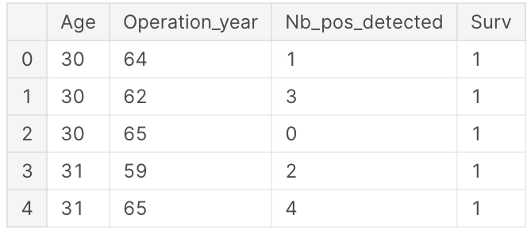
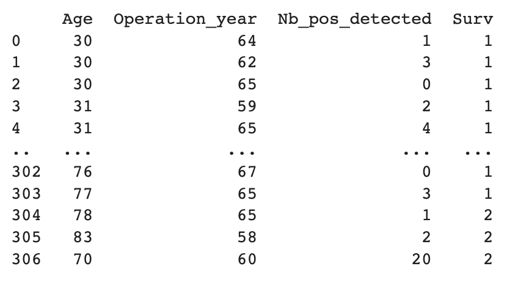

import MyChart from '@site/src/components/MyChart'
import ButtonGroup from "@site/src/components/ButtonGroup"

## 0. 개요

Cox PH Model은 생존분석에서 가장 널리 사용되는 방법 중 하나이며, 이 모델을 기반으로 한 웹앱을 제작하여 생존 분석에 대한 이해도와 활용도를 높일 수 있다.

본 연구의 목적은 Cox PH Model을 이용하여 생존 분석을 수행하는 웹앱을 제작하여 사용자 친화적이며 직관적인 인터페이스를 갖춘 웹앱을 개발하고자 하는 것이다. `lifelines` 라이브러리 적용을 통해 생존분석 데이터의 시각화가 최종 목표이다. 우리는 이를 위한 분석의 한 예로 `haberman's survival dataset`을 이용한다.

<MyChart />

<ButtonGroup />

## 1. 데이터 구성



위 데이터셋의 이름은 `Haberman's survival dataset`이다. 1958~1970년까지 시카고대학 빌링스 병원에서 유방암 수술을 받은 환자의 생존율에 대해 수행한 연구 사례가 포함되어 있다.

각 컬럼은 다음 정보를 나타낸다.

1. `Age`: 환자의 나이
2. `Operation_year`: 수술당시 연도를 10의 자리까지만 나타낸 값
3. `Nb_pos_detected`: 양성 림프종 수
4. `Surv`: 환자가 수술 후 5년 이내에 사망하였는지 여부. 5년 내에 사망할 경우 2라는 값을 갖는다.

이 데이터셋에서는 주로 생존 기간이 아닌 수술 후 5년 이내 생존 여부가 중요한 관심사이다. 따라서, 수술 후 5년 이내 생존한 환자들의 비율을 전체 환자 수로 나누어 생존율을 계산할 수 있다. 이러한 생존율은 해당 데이터셋에서 Surv값이 1인 환자들의 비율로 정의된다.

## 2. 데이터 취득방식

Kaggle에서는 전 세계적으로 데이터 사이언티스트들이 데이터셋을 공유하고 분서 결과를 공유할 수 있도록 지원하고 있다. 이러한 공유는 머신 러닝, 데이터 분석, 인공 지능 등의 분야에서 연구 및 개발에 많은 도움을 준다.

특히, Kaggle에서 제공하는 데이터셋은 다양한 분야에서 활용되어 논문이나 연구 보고서 등에 레퍼런스로 사용될 수 있다. `Haberman's survival dataset` 또한 Kaggle에서 다양한 용도로 활용되고 있으며, 이를 활용한 논문이나 연구 보고서가 발표되어 인용되는 경우도 있다.

아래는 Kaggle에서 제공하는 데이터셋을 활용하여 작성된 논문들의 예시이다.
아래는 그 예시이다.

1. [캐글 데이터셋을 이용한 머신러닝 악성코드 분류시스템에서 분류정확도 향상방법 - 한국컴퓨터정보학회 학술발표논문집 - 한국컴퓨터정보학회 : 논문 - DBpia](https://www.dbpia.co.kr/journal/articleDetail?nodeId=NODE08757681)
2. [Deep Learning for Practical Image Recognition | Proceedings of the 24th ACM SIGKDD International Conference on Knowledge Discovery & Data Mining](https://dl.acm.org/doi/abs/10.1145/3219819.3219907)
3. [1905.07203 Transfer Learning based Detection of Diabetic Retinopathy from Small Dataset](https://arxiv.org/abs/1905.07203)

파이썬 개발환경에서 아래 코드를 입력하여 데이터셋을 출력한 결과이다.

```python
import pandas as pd data = pd.read_csv('/content/haberman.csv', names = ['Age','Operation_year','Nb_pos_detected','Surv'])
```



## 3. 분석 방법론

### 3.1 생존 분석

생존분석은 시간의 흐름에 따른 어떠한 사건의 발생 확률을 알아보는 통계 분석 및 예측 기법 이다. 사건 발생을 시간의 함수로 모델링하여 일정 시점에서의 생존 확률을 추정한다. 사건 발생까지의 시간이 집단 간에 차이가 있는지 확인하고, 어떤 변수들이 사건 발생까지 시간에 영향을 미치는지 분석한다. 일반적으로 의료분야에서 특정 수술 방법 혹은 치료 방법에 따른 환자의 생존 기간을 분석할 때 활용하거나, 일반적인 IT 분야에서는 시간에 따른 사용자 이탈 분석에도 활용한다.

### 3.2 Censored Data

생존분석 시 관찰이 종료되는 시점 사이에서 사건 발생 여부를 확인할 수 없는 자료를 중도절 단(censored) 자료라고 한다. 일반적인 통계분석 방법과는 다르게 생존분석에서는 이런 자료 를 포함하여 분석을 진행한다. 중도절단 데이터는 관측기간 동안 분석 대상자에게서 사건이 일어나지 않을 때 발생한다. 환자의 추적이 어려운 상태, 환자가 더 이상 실험에 참여하지 않 기로 결정한 상태, 연구 종료로 더 이상의 추적조사 불가능한 상태, 연구와 관련 없는 이유로 사망한 상태 등의 경우에 해당된다. 중도절단 종류는 다양한데 left censoring(좌중도절단)은 실제 값이 특정 값 이하인 것은 알고 있지만 그 값이 정확히 어떤 값인지 모를 때 발생한다. right censoring(우중도절단)은 실제 값이 특정 값 이상인 것은 알고 있으나 그 값이 정확히 어떤 값인지 모를 때 발생한다.

### 3.3 생존함수와 위험함수

생존함수(survival function)는 적어도 $t$시점까지 생존할 확률을 의미한다. 일반적으로 생존 함수는 아래와 같이 나타낸다.

$$
S(t) = Pr(T > t) = 1 - P(t)
$$

$$
P(t) = Pr(T\leq t) = \int_{0}^{t}f(t)dt
$$

-   $S(t)$: 생존함수
-   $T$: 생존시간
-   $P(t)$: $T$의 누적확률분포함수
-   $f(t)$: $T$의 확률밀도함수

위와 같이 특정 시간 $t$보다 오래 생존할 확률을 뜻하는 생존함수가 있는 반면, 위험함수 (hazard function)는 $t$시점 직후 사망할 확률을 의미한다. 흔히 생존분석에서는 위험함수가 시간에 따라 변하는 추세를 시간에 따른 위험의 변화로 나타내기 때문에 위험함수가 갖는 의 미가 크다. 위험함수는 다음과 같이 정의한다.

## 4. Reference

1. Cox 비례위험모형을 이용한 우측 대장암 3기 자료 분석 – 한국데이터정보과학회 : 논문 – DBpia
2. Survival analysis: Part I — analysis of time-to-event, Junyong In et al., Korean Journal of Anesthesiology, 2018
3. 박난희(2010). 생존분석 자료를 이용한 Cox비례위험함수모형의 고찰. 석사학위논문. 이화여자대학교. 서울.
4. [Axillary lymph node dissection (ALND) | Canadian Cancer Society](https://cancer.ca/en/treatments/tests-and-procedures/axillary-lymph-node-dissection-alnd)
5. [Anatomy, Shoulder and Upper Limb, Axillary Lymph Nodes - StatPearls - NCBI Bookshelf](https://www.ncbi.nlm.nih.gov/books/NBK559188/)
6. [UCI Machine Learning Repository: Haberman's Survival Data Set](https://archive.ics.uci.edu/ml/datasets/Haberman's+Survival)
